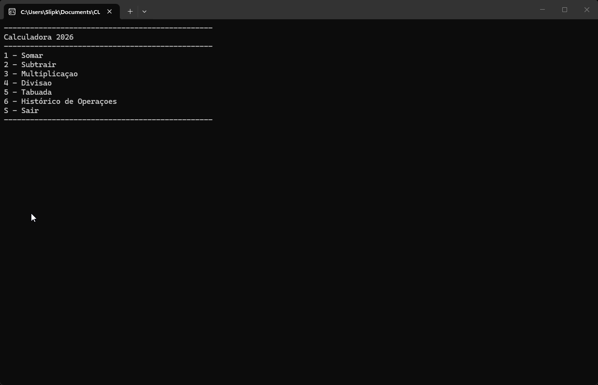

# Calculadora


## Projeto



Desenvolvido durante o curso Back-End da [Academia do Programador](https://www.academiadoprogramador.net) 2026

## Introdução

Uma calculadora de console, simples porém poderosa que nos permite realizar as quatro operações matemáticas, além da visualização do histórico de operações e a visualização da tabuada

## Funcionalidades

- **Operações Básicas**: Realiza Somas, Subtrações, multiplicações e divisões com facilidade.
- **Tabuada**: A calculadora é capaz de gerar a tabuada de um número informado até outro número informado (multiplicador).
- **Histórico de Operações**: A calculadora é capaz de armazenar na memória um histórico das operações anteriores.

## Como Ultilizar o Programa

1. Clone ou baixe os arquivos do repositório.
2. Abra o seu emulador de Terminal de preferência e navegue até a pasta raiz do projeto baixado.
3. Utilize o comando abaixo para restaurar as dependências do projeto.

    ```
    dotnet restore
    ```
4. Em seguida compile e execute projeto com o comando:

    ```
    dotnet run --project Calculadora.ConsoleApp
    ```

## Requesitos

= .Net 10.0 SDK